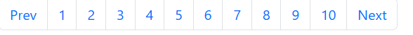

# React Pagination Example

This project demonstrates a simple implementation of pagination in a React application. The application fetches a list of posts from a public API and allows users to navigate through the posts using pagination.

## Table of Contents

- [Features](#features)
- [Installation](#installation)
- [Usage](#usage)
- [Project Structure](#project-structure)
- [Dependencies](#dependencies)
- [Contributing](#contributing)
- [License](#license)

## Features

- Fetches posts from a public API (`https://jsonplaceholder.typicode.com/posts`).
- Implements pagination to navigate through the posts.
- Displays a loading state while fetching data.
- Allows users to navigate to the previous or next set of posts using pagination controls.

## Installation

To run this project locally, follow these steps:

1. **Clone the repository:**

```bash
    git clone https://github.com/yourusername/react-pagination-example.git
```

2. **Navigate to the project directory:**

```bash
    cd react-pagination-example
``` 

3. **Install the dependencies:**

```bash
    npm install
```

4. **Start the development server:**

```bash
    npm start
```

5. **Open your browser and navigate to:**

    http://localhost:3000

## Usage
- Once the application is running, you'll see a list of posts with pagination controls at the bottom. You can click on the page numbers or the "Prev" and "Next" buttons to navigate through the posts.

## Example Components

- **App Component**: The main component that manages state and handles fetching posts from the API.
- **Posts Component**: Displays the list of posts for the current page.
- **Pagination Component**: Renders pagination controls and handles page navigation.

## Project Structure

react-pagination-example/
├── public/
│ ├── index.html
│ └── ...
├── src/
│ ├── components/
│ │ ├── Posts.js
│ │ └── Pagination.js
│ ├── App.css
│ ├── App.js
│ ├── index.js
│ └── ...
├── package.json
└── README.md

- `src/components/Posts.js`: Displays the list of posts.
- `src/components/Pagination.js`: Renders the pagination controls.
- `src/App.js`: Main application component.

## Dependencies

This project uses the following dependencies:

- **React**: A JavaScript library for building user interfaces.
- **Axios**: A promise-based HTTP client for the browser and Node.js.

To install these dependencies, use:

```bash
    npm install react axios
```

## Screenshot

